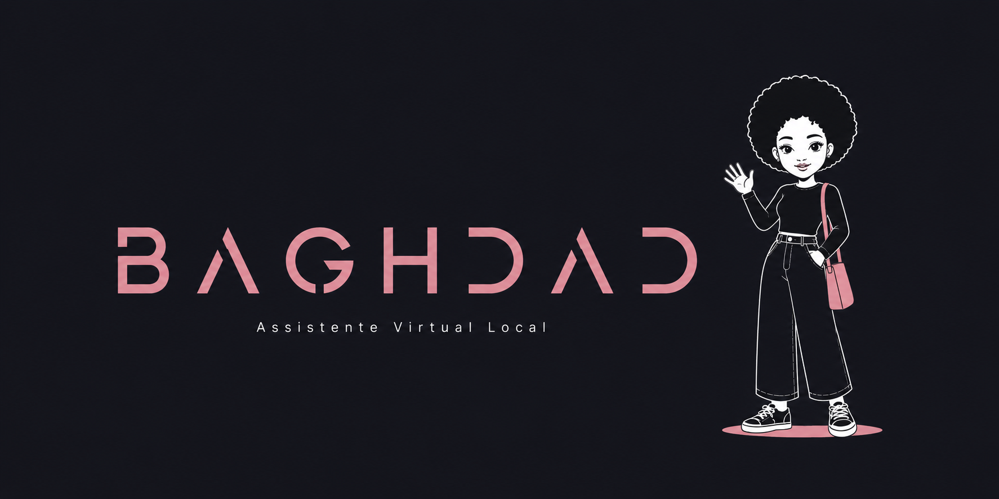

# Baghdad

**Assistente Virtual Local**

Baghdad é um projecto de assistente pessoal de Inteligência Artificial desenvolvido para funcionar de forma local, combinando **IA conversacional, memória, voz, avatar e hardware dedicado**.

O objectivo final é transformar o assistente num dispositivo físico independente baseado em Raspberry Pi.

---

## 🎯 Objectivo

A versão final deverá ser capaz de:

* [x] conversar naturalmente com o utilizador;
* [x] manter contexto da conversa;
* [x] possuir memória persistente;
* [x] recuperar memórias através de pesquisa semântica;
* [x] receber mensagens por texto;
* [x] receber comandos por voz;
* [x] responder através de voz;
* [ ] possuir personalidade avançada configurável;
* [ ] apresentar um avatar animado;
* [ ] utilizar ferramentas e serviços externos;
* [ ] funcionar num dispositivo físico dedicado;
* [ ] minimizar ao máximo a dependência de serviços cloud.

---

## 🧩 Componentes principais

O projecto está dividido em três grandes componentes.

### 1. 🧠 Agente de IA

Responsável pela inteligência e comportamento da Baghdad.

Inclui:

* modelo de linguagem;
* gestão da conversa;
* memória;
* processamento de voz;
* personalidade;
* ferramentas;
* integração com o avatar.

### 2. 🏗️ Infraestrutura

Responsável pelos serviços necessários para executar o agente.

Inclui:

* APIs locais;
* modelos de IA;
* base de dados;
* Docker;
* comunicação entre módulos;
* configurações e segurança;
* monitorização.

### 3. 🖥️ Hardware

Responsável pela futura implementação física do assistente.

Componentes previstos:

* Raspberry Pi;
* mini display;
* microfone;
* altifalante;
* alimentação;
* estrutura física;
* sensores e periféricos adicionais.

---

## 🏛️ Arquitectura técnica


---

## 🐳 Docker + Ollama

O **Ollama** funciona como servidor de inferência local dos modelos utilizados pela Baghdad.

Actualmente é executado através de Docker, permitindo:

* isolamento do ambiente;
* instalação mais limpa;
* maior facilidade de migração;
* gestão local dos modelos;
* disponibilização de uma API HTTP para a aplicação Python.

---

## 🦙 Gemma 3 4B

O modelo de linguagem actualmente utilizado é:

```text
Gemma 3 4B
```

Foi escolhido pelo equilíbrio entre:

* qualidade de conversação;
* suporte multilingue;
* tamanho;
* utilização de RAM;
* desempenho em CPU;
* capacidade do hardware actual de desenvolvimento.

O modelo é executado localmente através do Ollama.

---

## 🐍 Aplicação Python

A aplicação Python funciona como o **orquestrador principal** da Baghdad.

Actualmente é responsável por:

* receber texto ou voz;
* gerir o histórico da conversa;
* consultar memórias;
* construir o contexto enviado ao LLM;
* comunicar com o Ollama;
* guardar mensagens;
* identificar informações que devem ser memorizadas.

A interface actual funciona através do terminal.

---

## 🎙️ Reconhecimento de voz

Para converter voz em texto é utilizado:

```text
Faster-Whisper
```


O áudio captado pelo microfone é transcrito localmente e enviado para o mesmo fluxo utilizado pelas mensagens escritas.

```text
Microfone
    │
    ▼
Faster-Whisper
    │
    ▼
Texto
    │
    ▼
Baghdad
```

---

## 🧠 Memória

A Baghdad possui três mecanismos principais de memória.

### Memória de contexto

Mantém as mensagens recentes disponíveis durante a conversa actual.

### Histórico persistente

As mensagens são armazenadas numa base de dados SQLite, permitindo manter o histórico mesmo depois de a aplicação ser encerrada.

### Memória de longo prazo

Informações relevantes podem ser extraídas das conversas e guardadas separadamente.

Exemplo:

```text
Mensagem:
O meu carro preferido é Toyota Land Cruiser.

Memória:
preferencia | O utilizador prefere Toyota Land Cruiser.
```

As memórias podem ser classificadas como:

```text
preferencia
facto
objectivo
projecto
outro
```

---

## 🔎 Pesquisa semântica

Para geração de embeddings é utilizado:

```text
nomic-embed-text
```

O modelo transforma textos em representações vectoriais.

Quando uma nova mensagem é recebida, a Baghdad:

1. gera o embedding da mensagem;
2. compara-o com as memórias existentes;
3. utiliza similaridade de cosseno;
4. recupera as memórias mais relevantes;
5. adiciona essas memórias ao contexto do LLM.

Isto permite encontrar relações mesmo quando são utilizadas palavras diferentes.

```text
Memória:
O utilizador prefere Toyota Land Cruiser.

Pergunta:
Qual é o meu jipe favorito?
```

A pesquisa semântica consegue relacionar as duas informações.

---

## 🗄️ SQLite

Actualmente a base de dados possui duas estruturas principais.

### `mensagens`

```text
id
role
content
created_at
```

### `memorias`

```text
id
content
categoria
embedding
created_at
updated_at
```

O sistema possui mecanismos básicos para:

* detectar memórias semelhantes;
* reduzir duplicações;
* actualizar memórias;
* aplicar um nível mínimo de relevância durante a recuperação.

---

## 🔄 Fluxo actual

```text
1. Utilizador escreve ou fala
              │
              ▼
2. Voz é convertida em texto, se necessário
              │
              ▼
3. É criado o embedding da mensagem
              │
              ▼
4. Memórias relevantes são recuperadas
              │
              ▼
5. Contexto é enviado ao Gemma
              │
              ▼
6. Gemma gera a resposta
              │
              ▼
7. Conversa é armazenada no SQLite
              │
              ▼
8. A mensagem é analisada
              │
              ▼
9. Uma memória pode ser criada ou actualizada
```
